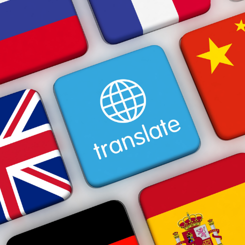
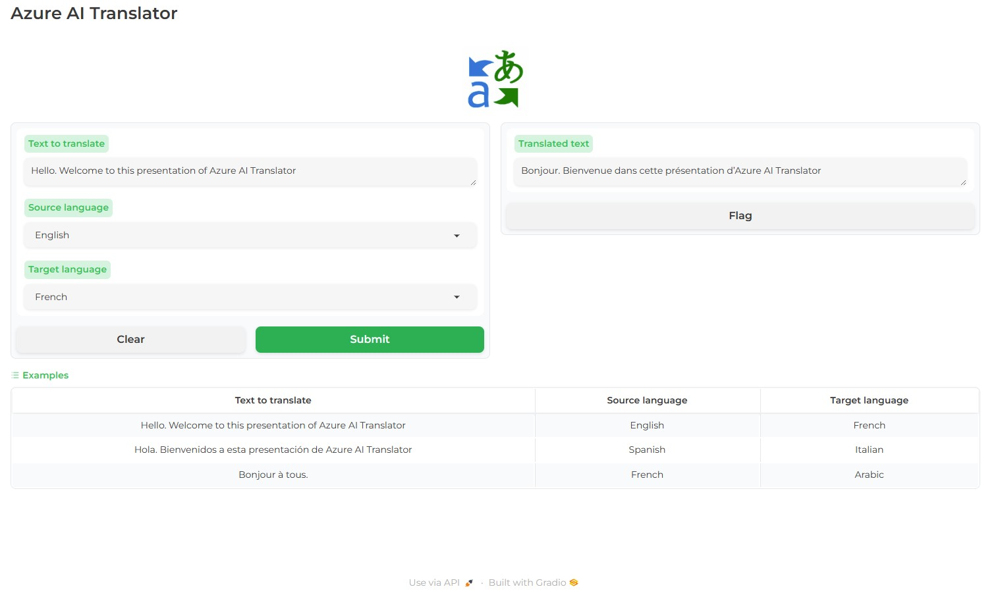
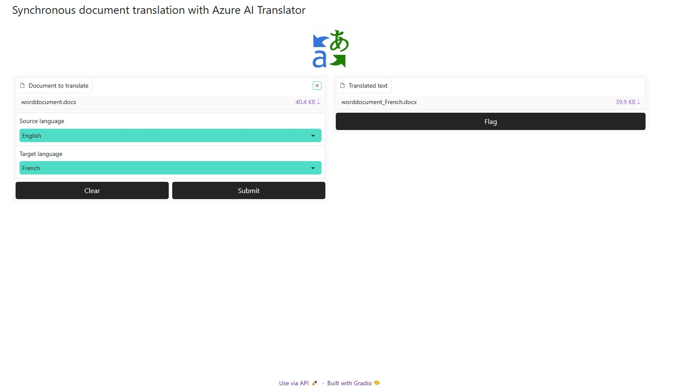
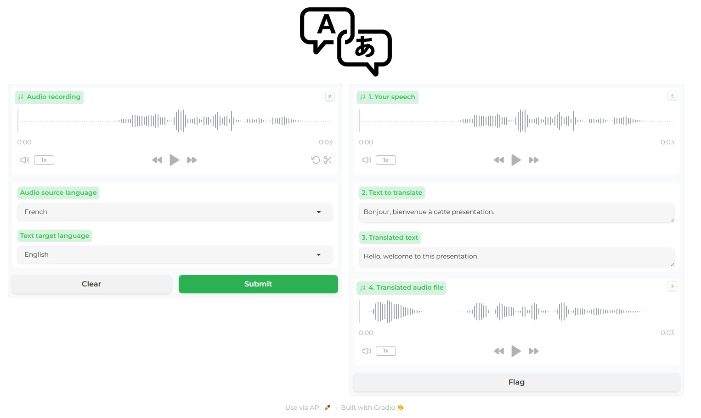

# Azure AI Translator: Demos & Professional Notebooks

**Azure AI Translator** is a robust, cloud-based neural machine translation service providing fast, accurate text and document translations in 135+ languages. Easily integrate real-time or batch translation directly into your applications using simple REST APIs. Take translation further with advanced features like custom translation models and containerized deployments for full control.

---

## 🚀 Key Features

- **Fast, Accurate Translation:** Leverages state-of-the-art neural machine translation for superior quality.
- **Text and Document Translation:** Translating both structured and unstructured data, synchronously or in batch/asynchronous modes.
- **Custom Translator:** Tailor models using your translation memory and domain-specific data for optimal results.
- **Automated Language Detection & Transliteration:** Detect languages and convert between scripts automatically.
- **Vocal & Speech Integration:** Combine with Azure Speech Services for end-to-end voice translation pipelines.
- **Containers Support:** Deploy locally or at the edge for regulatory or latency requirements.

Explore the official documentation for the full feature set:  
https://azure.microsoft.com/en-us/products/ai-services/ai-translator

---

## 📓 Python Demo Notebooks

Learn and prototype using a comprehensive set of Jupyter notebooks:

1. **Service Overview:**  
   [Azure AI Translator informations.ipynb](1%20Azure%20AI%20Translator%20informations.ipynb)
2. **Language Detection:**  
   [Language detection.ipynb](2%20Language%20detection.ipynb)
3. **Transliteration Examples:**  
   [Transliterate example.ipynb](3%20Transliterate%20example.ipynb)
4. **Text Translation:**  
   [Translation.ipynb](4%20Translation.ipynb)
5. **Batch Document Translation:**  
   [Document translation batch.ipynb](5%20Document%20translation%20batch.ipynb)
6. **Synchronous Document Translation:**  
   [Synchronous Document Translation.ipynb](6%20Synchronous%20Document%20Translation.ipynb)
7. **Vocal Translator Using Azure AI:**  
   [Vocal Translator using Azure AI.ipynb](7%20Vocal%20Translator%20using%20Azure%20AI.ipynb)
8. **Voice Translation with Azure Speech Services:**  
   [Vocal Translator using Azure AI STT.ipynb](8%20Vocal%20Translator%20using%20Azure%20AI%20STT.ipynb)

> **Note:**  
> Please update the `azure.env` file with your Azure AI Services credentials to run the demos.

---

## 🖥️ Web Application Examples

- **Text Translation Webapp:**  
  

- **Document Translation Webapp:**  
  

- **Vocal Translation Webapp:**  
  

---

## 🔥 Azure AI Translator Highlights

### Text Translation
Translate text between over 135 languages in real time. Supports custom dictionaries and translation exclusions.
- Docs: https://learn.microsoft.com/en-us/azure/ai-services/translator/text-translation-overview

### Asynchronous Batch Document Translation
Automate translations for large-scale and complex documents while preserving original structure and formatting. Glossary support included.
- Docs: https://learn.microsoft.com/en-us/azure/ai-services/translator/document-translation/overview

### Synchronous Document Translation
Quickly translate single documents (no blob storage required). Optional glossary support.
- Docs: https://learn.microsoft.com/en-us/azure/ai-services/translator/document-translation/reference/synchronous-rest-api-guide

### Custom Translator
Train and deploy translation models customized to your domain, terminology, and style.
- Docs: https://learn.microsoft.com/en-us/azure/ai-services/translator/custom-translator/overview

---

## 📚 Additional Documentation & Resources

- [Azure AI Translator documentation](https://learn.microsoft.com/en-us/azure/ai-services/translator/)
- [Language Support List](https://learn.microsoft.com/en-us/azure/ai-services/translator/language-support)
- [Service Pricing](https://azure.microsoft.com/en-us/pricing/details/cognitive-services/translator/)
- [What’s New](https://learn.microsoft.com/en-us/azure/ai-services/translator/whats-new?tabs=csharp)
- [Official Windows Application](https://github.com/MicrosoftTranslator/DocumentTranslation/releases)
- [MicrosoftTranslator Repositories](https://github.com/orgs/MicrosoftTranslator/repositories)
- [Translator FAQ](https://learn.microsoft.com/en-us/azure/ai-services/translator/translator-faq)

---

## 📝 Getting Started

1. Clone this repository.
2. Update the `azure.env` file with your Azure subscription and Translator credentials.
3. Open and explore the notebooks in your preferred Python & Jupyter environment.

---

## 📅 Project Info

- **Created:** 10-April-2024
- **Updated:** 20-November-2025
- **Author:** Serge Retkowsky  
- [LinkedIn](https://www.linkedin.com/in/serger/) | serge.retkowsky@microsoft.com