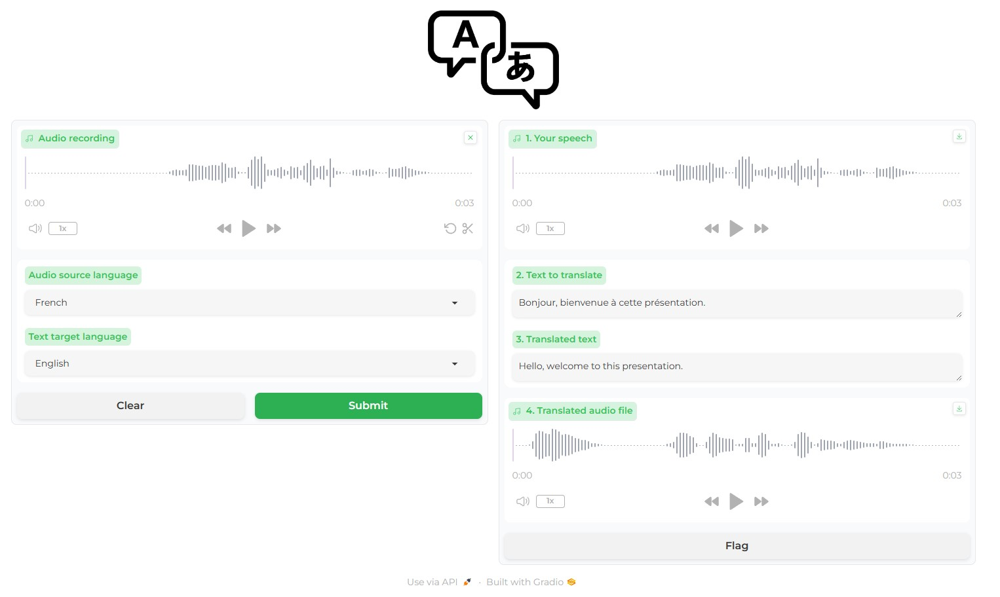

# Azure AI Translator demos

**Azure AI Translator** is a cloud-based machine translation service you can use to translate text and documents with a **simple REST API call**. 
The service uses modern **neural machine translation technology**.  
This service can do **asynchronous batch document translation** and **synchronous document translation.** 
The **Custom Translator interface** allows you to use your translation memory to create **customized neural translation systems**. The customized translation system can be used to translate text and documents with the Translator service.  
More than 100 languages are recognized. 
https://learn.microsoft.com/en-us/azure/ai-services/translator/language-support  
Containers are available for Azure AI Translator.  
Website: https://azure.microsoft.com/en-us/products/ai-services/ai-translator 

## 1. Python demos notebooks
1. Azure AI Translator informations
<a href="1 Azure AI Translator informations.ipynb">Notebook</a>
2. Language detection
<a href="2 Language detection.ipynb">Notebook</a>
3. Transliterate example
<a href="3 Transliterate example.ipynb">Notebook</a>
4. Translation
<a href="4 Translation.ipynb">Notebook</a>
5. Document translation batch
<a href="5 Document translation batch.ipynb">Notebook</a>
6. Synchronous Document Translation
<a href="6 Synchronous Document Translation.ipynb">Notebook</a>
7. Vocal Translator using Azure AI
<a href="7 Vocal Translator using Azure AI.ipynb">Notebook</a>
8. Vocal Translator using speech to text and text to Speech with Azure Speech Services
<a href="8 Vocal Translator using Azure AI STT.ipynb">Notebook</a>
  
Note: you need to update the **azure.env** file with your Azure AI Translator informations.

## 2. Some webapp screenshots

### An exemple of a custom webapp for text translation
 

### An exemple of a custom webapp for document translation
 

### An exemple of a custom webapp for vocal translation
 

## 3. Azure AI features

### Text Translation
Execute text translation between supported source and target languages in real time. Create a dynamic dictionary and learn how to prevent translations using the Translator API.
  
https://learn.microsoft.com/en-us/azure/ai-services/translator/text-translation-overview

### Asynchronous Batch Document Translation
Translate batch and complex files while preserving the structure and format of the original documents. Create a glossary to use with document translation. The batch translation process requires an Azure Blob storage account with containers for your source and translated documents.
  
https://learn.microsoft.com/en-us/azure/ai-services/translator/document-translation/overview

### Synchronous Document translation
Translate a single document file alone or with a glossary file while preserving the structure and format of the original document. The file translation process doesn't require an Azure Blob storage account. The final response contains the translated document and is returned directly to the calling client.
  
https://learn.microsoft.com/en-us/azure/ai-services/translator/document-translation/reference/synchronous-rest-api-guide

### Custom Translator
Build customized models to translate domain- and industry-specific language, terminology, and style. Create a dictionary (phrase or sentence) for custom translations.
  
https://learn.microsoft.com/en-us/azure/ai-services/translator/custom-translator/overview

## 4. Documentation and links

### Azure AI Translator documentation
https://learn.microsoft.com/en-us/azure/ai-services/translator/

### Language support
https://learn.microsoft.com/en-us/azure/ai-services/translator/language-support

### Pricing
https://azure.microsoft.com/en-us/pricing/details/cognitive-services/translator/

### What's new
https://learn.microsoft.com/en-us/azure/ai-services/translator/whats-new?tabs=csharp

### Windows application
https://github.com/MicrosoftTranslator/DocumentTranslation/releases

### Repositories
https://github.com/orgs/MicrosoftTranslator/repositories

### FAQ
https://learn.microsoft.com/en-us/azure/ai-services/translator/translator-faq
  

10-April-2024 - Updated 11-April-2024 
Serge Retkowsky | serge.retkowsky@microsoft.com | https://www.linkedin.com/in/serger/
